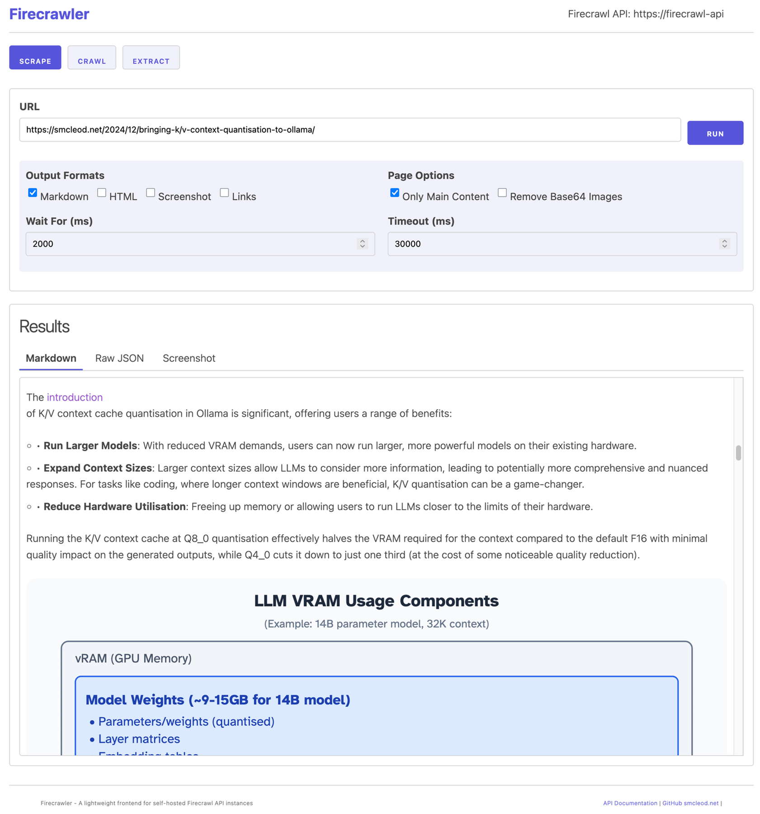

# Firecrawler

A lightweight frontend for self-hosted Firecrawl API instances. This playground provides a user-friendly interface for using Firecrawl's web scraping and crawling capabilities.

## Features

- **Scrape Mode**: Convert a single URL to markdown, HTML, or take screenshots
- **Crawl Mode**: Discover and scrape multiple pages from a starting URL
- **Extract Mode**: Extract structured data from web pages using LLM
- **CORS-free**: Uses a proxy server to avoid CORS issues when connecting to your Firecrawl API instance



## Getting Started

### Running Locally

1. Configure environment variables:
   ```shell
   cp .example.env .env
   ```
   Edit the `.env` file to set your desired configuration.
2. Install dependencies and run:
   ```shell
   npm i
   npm start
   ```
3. Open your browser and navigate to `http://localhost:3000`
4. Enter your Firecrawl API endpoint (default: http://firecrawl:3002)
5. Enter your API key if required
6. Choose a mode (Scrape, Crawl, or Extract), enter a URL, and click "Run"

### Using Docker

1. Configure environment variables:
   ```
   cp .example.env .env
   ```
   Then edit the `.env` file to set your desired configuration.

2. Build and run using Docker Compose:
   ```
   docker-compose up -d
   ```

3. Open your browser and navigate to `http://localhost:3000`

## Modes

### Scrape Mode

Scrape mode allows you to convert a single URL to various formats:

- **Markdown**: Clean, readable markdown format
- **HTML**: Raw HTML content
- **Screenshot**: Visual capture of the page
- **Links**: Extract all links from the page

Advanced options include:

- Only Main Content: Filter out navigation, footers, etc.
- Remove Base64 Images: Exclude embedded images
- Wait For: Time to wait for dynamic content to load
- Timeout: Maximum time to wait for the page to load

### Crawl Mode

Crawl mode allows you to discover and scrape multiple pages from a starting URL:

- **Max Depth**: How many links deep to crawl
- **Page Limit**: Maximum number of pages to crawl
- **Ignore Sitemap**: Skip sitemap.xml discovery
- **Allow External Links**: Crawl links to external domains
- **Include/Exclude Paths**: Filter which paths to crawl

### Extract Mode

Extract mode allows you to extract structured data from web pages using LLM:

- **Extraction Prompt**: Instructions for what data to extract
- **JSON Schema**: Optional schema for structured data extraction

## API Compatibility

This playground is designed to work with self-hosted Firecrawl API instances. It's compatible with the Firecrawl API v1 endpoints.

## Development

This is a lightweight application built with vanilla JavaScript, HTML, and CSS. Dependencies are loaded from CDNs:

- Milligram CSS for minimal styling
- Marked.js for markdown rendering
- Highlight.js for syntax highlighting

No build process is required - simply edit the files and refresh the browser to see changes.

## Technical Details

- **Server**: Node.js with Express
- **Proxy**: Custom HTTP proxy middleware
- **Configuration**: Environment variables via dotenv (.env file)

## Firecrawler Examples

Here are some examples of how to use the Firecrawler with different modes.

### Scrape Mode Examples

### Basic Markdown Conversion

1. Enter URL: `https://smcleod.net`
2. Select Format: `markdown`
3. Enable "Only Main Content"
4. Click "Run"

#### Screenshot Capture

1. Enter URL: `https://news.ycombinator.com`
2. Select Formats: `markdown`, `screenshot`
3. Set Wait For: `3000` (3 seconds)
4. Click "Run"

#### HTML Extraction

1. Enter URL: `https://github.com`
2. Select Formats: `html`, `markdown`
3. Disable "Only Main Content" to get the full page
4. Click "Run"

### Crawl Mode Examples

#### Basic Website Crawl

1. Switch to "Crawl" mode
2. Enter URL: `https://smcleod.net`
3. Set Max Depth: `2`
4. Set Page Limit: `10`
5. Select Format: `markdown`
6. Click "Run"

#### Blog Crawl with Path Filtering

1. Switch to "Crawl" mode
2. Enter URL: `https://smcleod.net/about`
3. Set Max Depth: `3`
4. Set Page Limit: `20`
5. Include Paths: `blog,posts`
6. Exclude Paths: `admin,login,register`
7. Click "Run"

### Extract Mode Examples

#### Basic Content Extraction

1. Switch to "Extract" mode
2. Enter URL: `https://smcleod.net`
3. Extraction Prompt: `Extract the main heading, summary, and author from this page.`
4. Click "Run"

#### Structured Data Extraction

1. Switch to "Extract" mode
2. Enter URL: `https://news.ycombinator.com`
3. Extraction Prompt: `Extract the top 5 stories with their titles, points, and authors.`
4. JSON Schema:
```json
{
  "type": "object",
  "properties": {
    "stories": {
      "type": "array",
      "items": {
        "type": "object",
        "properties": {
          "title": { "type": "string" },
          "points": { "type": "number" },
          "author": { "type": "string" }
        }
      }
    }
  }
}
```
5. Click "Run"
